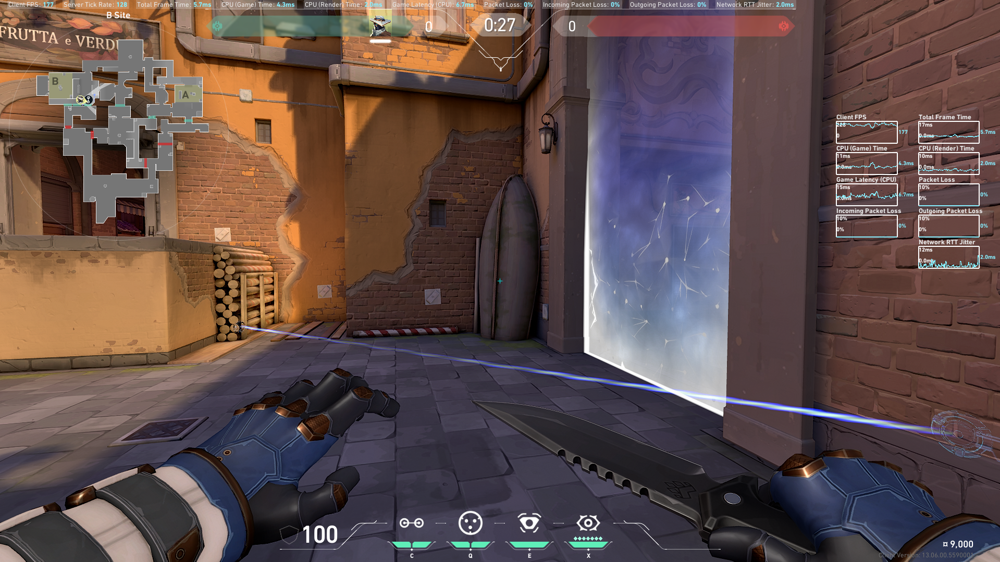
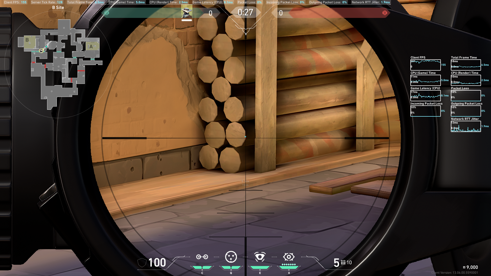
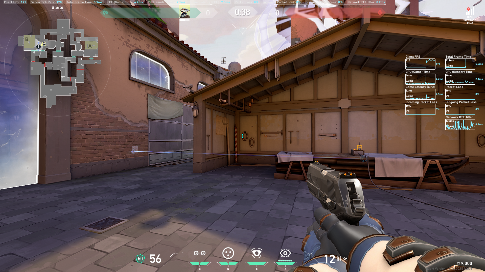
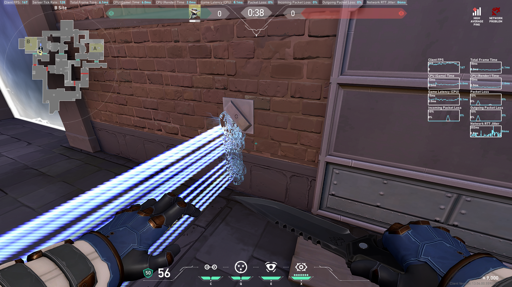

## B site diagonal entry trip
Placement: on the edge of the second log
Coverage: regular entry
Vulnerbility: raze nade, flying entry

## B site Lane and Boathouse trip
placement: any where along the left half of the metal patch, waist and below.
Coverage: Lane(bangable after revealed), front entrance of boathouse.

